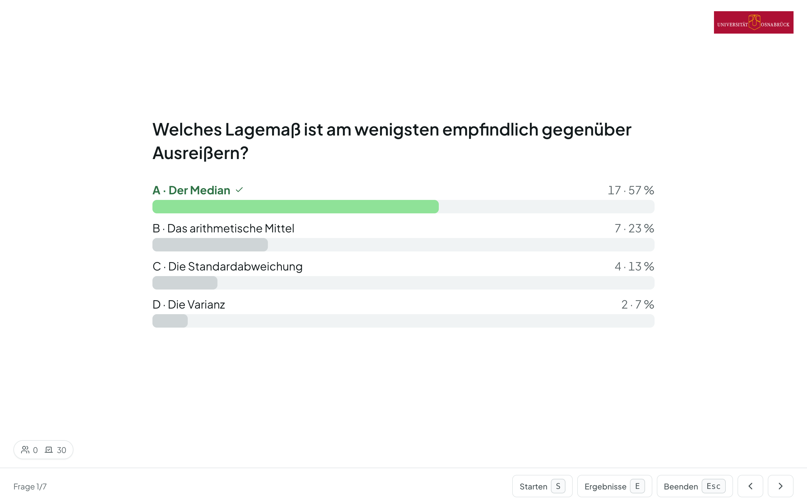
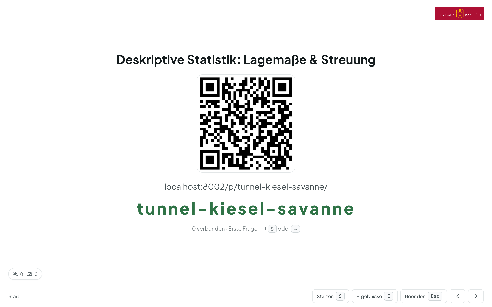
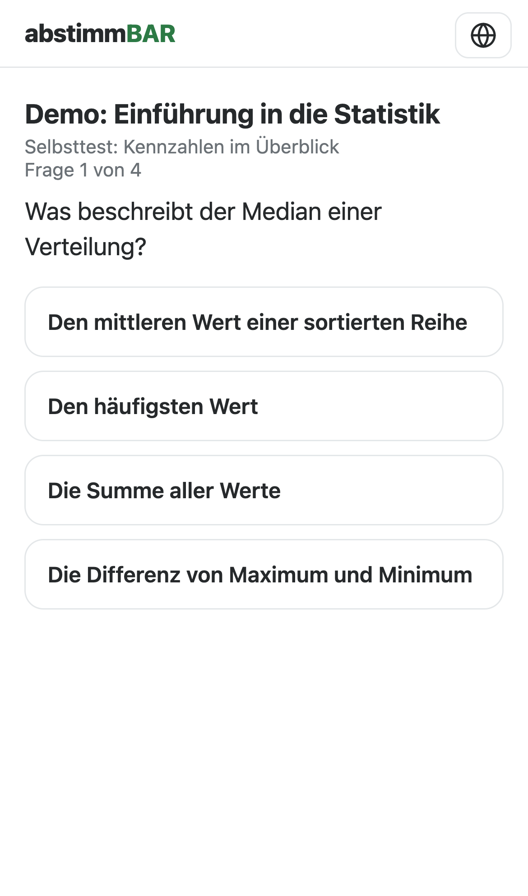
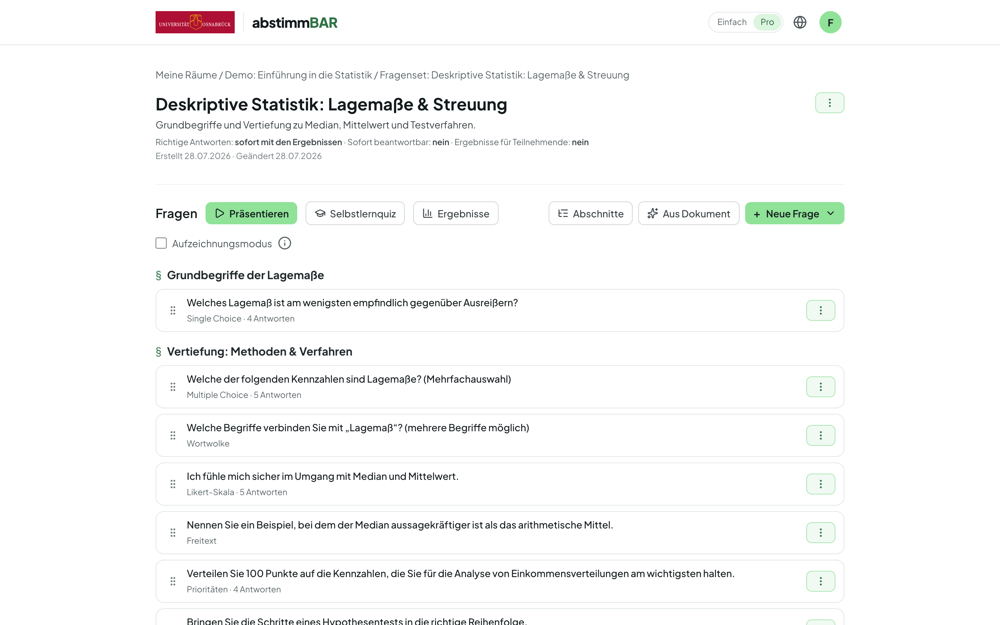
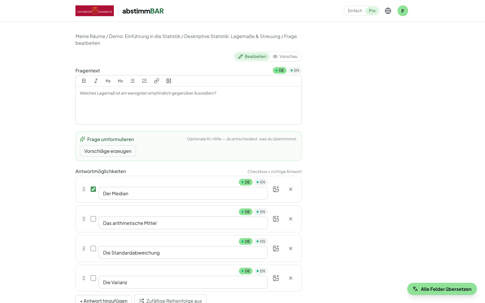
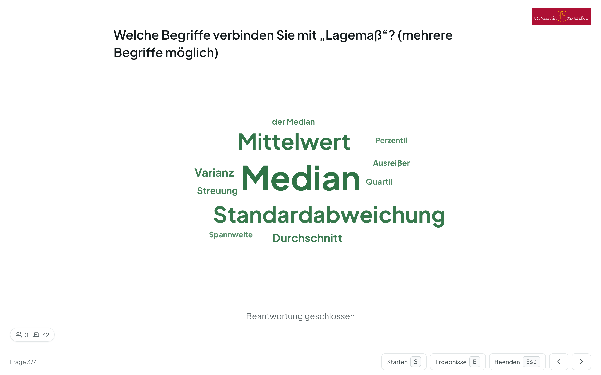
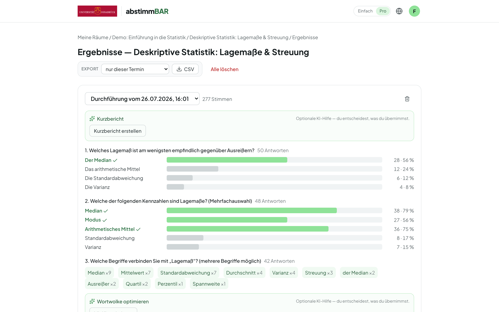
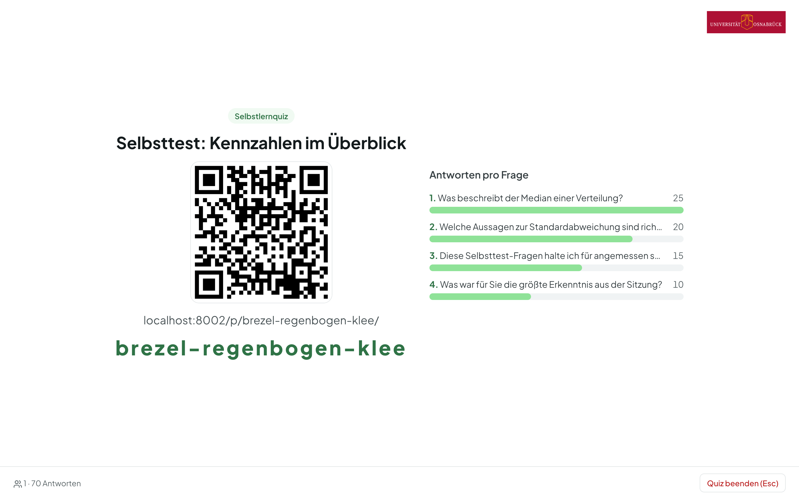
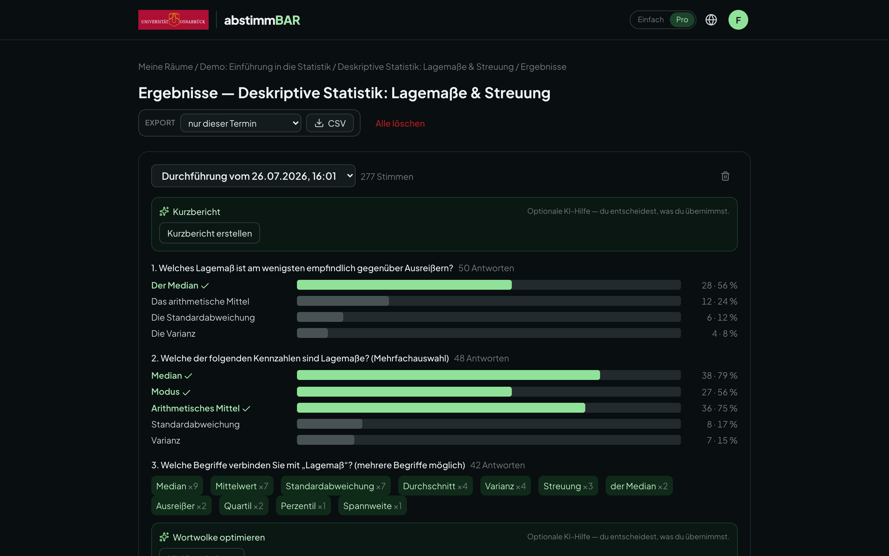
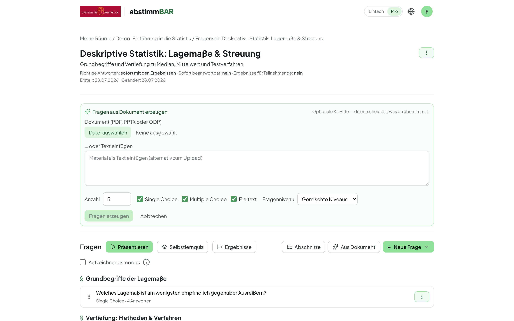

# Abstimmbar — open-source audience response system for universities

**Abstimmbar** is an open-source audience response system (ARS): lecturers
run live quizzes and polls in class, students answer anonymously on their
own devices via QR code or short URL — no login, no app. It integrates into
learning management systems via **LTI 1.3 / LTI Advantage** and supports
staff login via **OpenID Connect** (e.g. Keycloak).

It is the successor to the Stud.IP plugin **Cliqr**, feature-wise oriented
at [ARSnova/Particify](https://particify.de), and is developed at
[**virtUOS**, Universität Osnabrück](https://www.virtuos.uni-osnabrueck.de/)
as a sibling project to
[Ausleihbar](https://gitlab.uni-osnabrueck.de/virtuos/digitale-dienste/ausleihbar),
sharing its design language and stack. Released under the
**Apache License 2.0**.

> **Status: usable.** The full MVP loop (M0–M3), **LTI 1.3** integration
> (M4) and a broad set of v2 features are implemented and load-tested at
> 1000 concurrent participants. Pending: manual acceptance against a
> production LMS. Reviewable background documents:
>
> - [`docs/concept.md`](docs/concept.md) — Funktionsumfang & fachliches Konzept
> - [`docs/roadmap.md`](docs/roadmap.md) — Meilensteine (MVP → v2 → Ausblick)
> - [`docs/decisions/`](docs/decisions/) — Architekturentscheidungen (ADRs)

  
   
  <em>Presenter view — a live question with real-time results on the beamer.</em>

## Highlights

- 🎓 **Teacher-paced live quizzes** — start/stop each question from a
  distraction-free presenter view (beamer-friendly, keyboard shortcuts),
  live vote counter, results as bar charts. A **self-paced mode** lets
  students work through a set at their own speed with instant feedback.
- 📱 **Anonymous participation** — join via QR code, short URL or room code;
  an ultra-lightweight, framework-free participant page that loads instantly
  on phones in a packed lecture hall. No account, no IP logging on votes.
- 🧩 **Question formats** — single & multiple choice (with images as
  options), word clouds, Likert scales, open text, priorities and
  ordering/ranking. Optional per-question countdown timer; optional
  section slides to structure a set.
- 🔗 **LMS integration via LTI 1.3** — resource-link launch and deep linking
  (Stud.IP, Moodle, ILIAS, …), embeddable in an LMS iframe; no LTI 1.1
  legacy. Grade passback (AGS/NRPS) planned for assessed use later.
- 🔐 **University SSO** — OIDC login (Keycloak) for lecturers and admins,
  with back-channel logout. Any authenticated person can create rooms.
- 🌐 **Bilingual DE/EN** — both the interface and authored content
  (per-language question and option text), with an optional machine-
  translation pre-fill in the editor (see below).
- 📊 **Results & reuse** — results view with per-run deletion and CSV
  export, sanitized JSON export/import, question-set duplication across
  rooms, full-text search, sharing & co-ownership of rooms and sets.
- 🖼️ **Robust image handling** — drag-and-drop images in questions are
  normalized on upload (downscaled, re-encoded to WebP) so they stay sharp
  on beamer and phone without bloating storage.

## Screenshots

**Joining is instant and anonymous** — students scan a QR code or type a short
code; the participant page is a tiny, framework-free bundle that loads fast on
phones in a packed lecture hall.

<table>
  <tr>
    <td width="62%"></td>
    <td width="38%"></td>
  </tr>
</table>

**Author once, present anywhere** — a lean WYSIWYG editor with seven question
types, sections, drag-and-drop images and per-language DE/EN content.

<table>
  <tr>
    <td width="50%"></td>
    <td width="50%"></td>
  </tr>
</table>

**Results during and after the session** — live bar charts and word clouds in
the presenter view; a stored results page afterwards with CSV export, plus a
self-paced quiz mode students can work through on their own.

  
   
  <em>Live word cloud — terms sized by frequency (case and spelling variants merged).</em>

<table>
  <tr>
    <td width="50%"></td>
    <td width="50%"></td>
  </tr>
</table>

The whole interface is theme-aware (light / dark) and bilingual DE/EN.

  

## ✨ AI features (optional, off by default)

Abstimmbar ships a set of opt-in AI helpers that assist authoring and
analysis without ever taking a human out of the loop. **They are disabled
out of the box** and only activate when a deployment points them at an
LLM endpoint — which can be a **self-hosted, OpenAI-compatible model**
(e.g. via a [LiteLLM](https://github.com/BerriAI/litellm) proxy), so student
data never has to leave your institution. Every AI output is a *draft* a
human reviews before anything is saved, and vote tallies are always
recomputed from the real votes — the model can group and label, never
invent numbers.

  
   
  <em>Generate draft questions from a slide deck — you choose which to keep.</em>

- 🧠 **Generate questions from your slides** — upload a PDF, PPTX or ODP
  (or paste text) and get draft single/multiple-choice and open-text
  questions, with adjustable count and cognitive level (Bloom-inspired).
  You pick which drafts to keep; nothing is imported automatically.
- ✏️ **Authoring assists** — one click to suggest plausible distractors for
  a choice question, or to rephrase a question more clearly. Suggestions are
  proposed, never auto-applied.
- ☁️ **Smarter word clouds** — during a run, the AI view merges spelling
  variants, typos and synonyms into groups and sorts them into themes
  (automatic, or by a criterion you set, e.g. "by music genre"). Computed
  live and kept warm so the view is instant; counts come from the raw votes.
- 📝 **Open-text evaluation** — classify free-text answers into categories
  (default *correct / unclear / wrong*, or your own 2–5 labels) against an
  optional reference answer, live as votes arrive or on demand for a whole
  run.
- 📄 **Run summaries** — generate a short, display-only Markdown summary of a
  run's aggregated, anonymous results.
- 🌍 **Machine translation** — optional pre-fill of DE/EN content
  translations in the editor via a self-hosted
  [LibreTranslate](https://libretranslate.com/); it drafts into empty
  fields and never overwrites your own wording.

Each helper is gated behind a global switch (`AI_PROVIDER`,
`CONTENT_TRANSLATION_PROVIDER`), and the live word-cloud/open-text analyses
additionally require a per-question opt-in. All AI traffic goes only to the
endpoint the operator configures. See
[`docs/concept.md`](docs/concept.md) and `.env.prod.example` for the
configuration knobs.

## Stack

Django 5 + Django REST Framework + PostgreSQL · React + Vite + TypeScript +
Tailwind CSS · SSE for realtime · OIDC via Keycloak · LTI 1.3 via pylti1p3 ·
Docker Compose. Rationale: [ADR-0001](docs/decisions/0001-tech-stack.md).

## Contact

Developed and maintained by **virtUOS — Universität Osnabrück**
(<https://www.virtuos.uni-osnabrueck.de/>).

**Contact / maintainer:** Rüdiger Rolf · <rrolf@uni-osnabrueck.de>

Questions, ideas and contributions are welcome — please open an issue or merge
request in this project.

## License

Apache License 2.0 — see [LICENSE](LICENSE).
